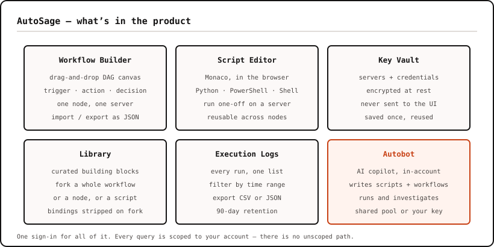
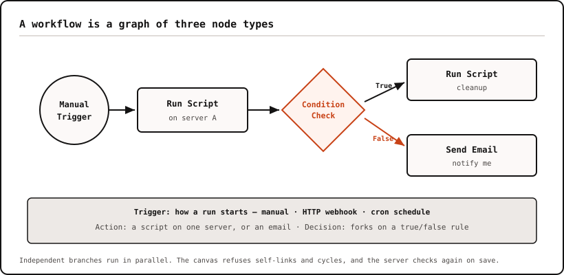
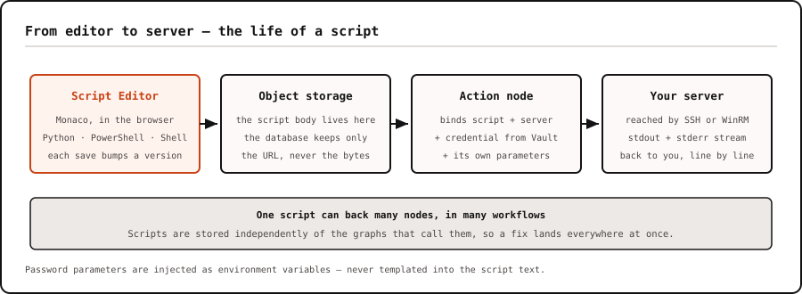
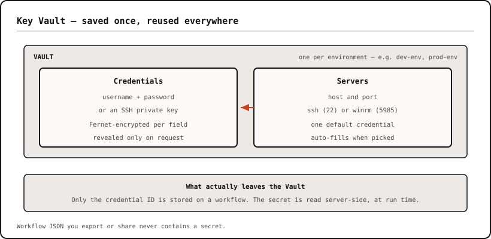
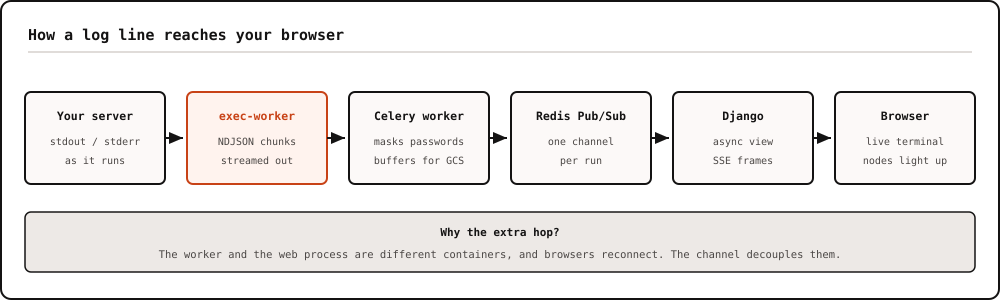
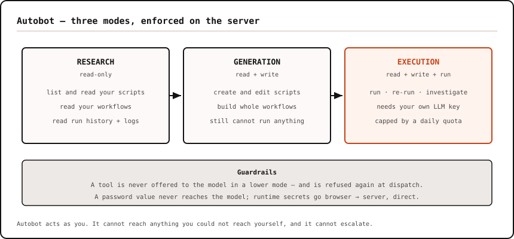
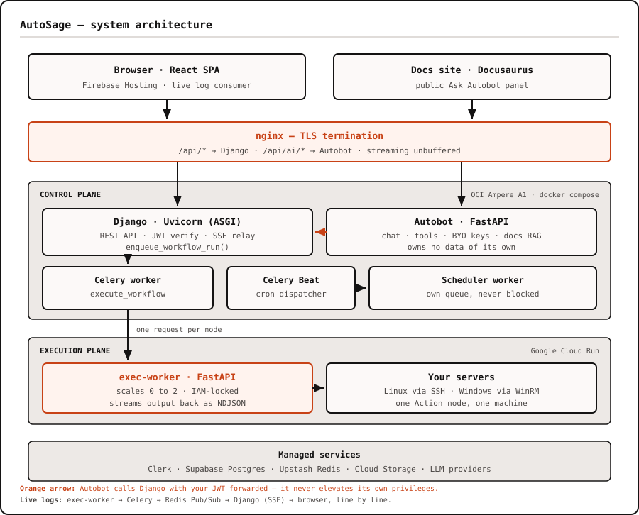
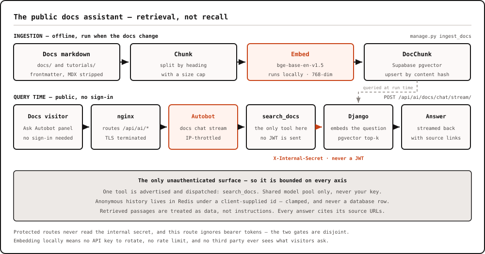

**Autosage** is a server management and workflow automation platform. You connect your servers, write scripts, chain them into visual workflows, and run them on demand, on a schedule, or from a webhook — with logs streaming back to your browser as each step executes. On top of it sits **Autobot**, an AI copilot that can generate scripts and workflows, investigate failed runs, and — when you let it — safely execute automations.

It's live at **[autosagex.web.app](https://autosagex.web.app)**, with documentation at **[autosagexdocs.web.app](https://autosagexdocs.web.app)**.

This article covers what Autosage does, what's inside it, and the engineering decisions behind it.

---

## Why I built it

Autosage came from a very practical problem: routine server work has a habit of scattering itself across a team.

- Scripts live on someone's laptop, in a gist, or in a wiki page that's three months stale.
- Cron jobs run on the box itself — invisible until they silently stop.
- When something fails at 2 a.m., there's no log to read and no history to compare against.
- Credentials get pasted into scripts, then committed.

The tooling that solves this at scale (Ansible Tower, Rundeck, enterprise schedulers) is heavy. The tooling that's light (Zapier, n8n) is built for SaaS APIs, not for running a PowerShell script on a Windows box over WinRM.

I wanted one place where I could store and version scripts, connect remote Linux and Windows machines, build multi-step automations visually, trigger them from the UI, cron, or webhooks, watch execution logs in real time — and add an AI layer that actually understands the product instead of just producing generic code.

Autosage sits in that gap.

---

## What Autosage is

If you've used n8n or Zapier, the workflow concept will feel familiar — a canvas, nodes, edges. The difference is what a node _does_: in Autosage, an Action node runs a real script on a real server you own.

The central design rule is **one node, one server**. Each Action node targets exactly one machine. To act on five servers, you add five nodes — and because the engine walks the graph, independent nodes run in parallel.



### Core concepts

| Concept      | What it is                                                               |
| ------------ | ------------------------------------------------------------------------ |
| **Workflow** | A visual graph (DAG) of nodes that runs as one unit                      |
| **Node**     | A single step — a trigger, an action, or a decision                      |
| **Script**   | A Python, PowerShell, or Shell file, reusable across any number of nodes |
| **Vault**    | Encrypted storage for your servers and their credentials                 |
| **Run**      | One execution of a workflow, with full per-node logs and status          |

---

## What's inside

### 1. Visual workflow builder

The builder is a drag-and-drop canvas. Every workflow starts with exactly one Trigger node and flows downward through Actions and Decisions.

| Node type    | Variants                              | What it does                                                             |
| ------------ | ------------------------------------- | ------------------------------------------------------------------------ |
| **Trigger**  | Manual · HTTP Webhook · Job Scheduler | Decides _how_ a run starts. Exactly one per workflow, no incoming edges. |
| **Action**   | Script · Email                        | Does the work — runs a script on one server, or sends a notification.    |
| **Decision** | —                                     | Evaluates rules and forks the run down a true or false edge.             |

Decision nodes are how you express "only continue if the build passed" or "clean up when disk usage is over 90%" without writing error handling into every script. Each one holds a list of rules — a field, an operator (`==`, `!=`, `>`, `<`, `>=`, `<=`, `contains`), and a value — joined with AND or OR, with two outgoing edges for the true and false paths.

On the frontend, **React Flow** powers the canvas, and it validates as you draw it: it refuses to connect a node to itself, refuses any edge that would create a cycle, and refuses a second edge from the same decision branch. The same rules run again on the server when you save or run, so an imported or hand-edited file can't smuggle in a broken graph.

Workflows import and export as JSON, so you can keep them in Git or move them between accounts.

> The builder and the script editor are desktop-only — the canvas needs the screen space.



### 2. Parameters — how values flow between nodes

Parameters are what make a workflow reusable. The same node can deploy `v1.2.0` on Monday and `v1.3.0` on Friday by changing one input.

They're declared per Action node, and each one draws its value from either an **upstream node's output** or a **manual default**.

| Type         | Holds              | How it reaches the script                                   |
| ------------ | ------------------ | ----------------------------------------------------------- |
| String       | Text               | Substituted into the script source                          |
| Number       | Integer or decimal | Substituted as a bare number                                |
| Boolean      | `true` / `false`   | Substituted as a literal                                    |
| **Password** | A secret           | **Injected as an environment variable — never substituted** |

> **Decision: password parameters are injected as environment variables, not templated into the script.**
> For the other three types, Autosage replaces the `{{param}}` token in the script text before execution. That's fast and predictable — but it puts the value _inside the script body_, where a careless `echo` would dump it straight into the run log. Password parameters skip templating entirely and arrive as an environment variable (`$DB_PASSWORD` in Shell, `$env:DB_PASSWORD` in PowerShell). The value never exists in the script text, so it can't leak by accident.

**Structured output.** A Script node can declare its output as plain text or as **structured JSON**, with a schema you design in the builder. That choice is what makes field-level wiring possible: when a node emits structured JSON, its individual fields show up in the parameter picker and in Decision rules, so downstream nodes select a field instead of parsing raw text.

### 3. Script editor and remote execution

A Monaco-based editor (the one that powers VS Code), with syntax highlighting, starter templates, and completion snippets for Python, PowerShell, and Shell. Scripts live independently of workflows and are reusable across any number of nodes; each save bumps the script's version number.

You can run a script one-off against any connected server straight from the editor — pick a server and its linked credential fills itself in — then watch the output stream back. It's the fastest way to iterate before wiring the script into a workflow.

Under the hood, the execution plane speaks **SSH via Paramiko**, **WinRM via pywinrm**, and **SMTP via aiosmtplib** — so Autosage orchestrates across mixed Linux and Windows fleets, not just Linux boxes.



### 4. Key Vault

The Vault holds the things you don't want in a script. It has three levels:

- **Vault** — the container. Create several (`dev-env`, `prod-env`) to keep environments apart.
- **Credential** — a username/password pair or an SSH key.
- **Server** — a host, port, and connection method (`ssh` for Linux on 22, `winrm` for Windows on 5985), optionally linked to a default credential.

Link a credential to a server, and picking that server in a node auto-fills the credential.

Everything secret is encrypted at rest per-field with **Fernet**, and the API never returns plaintext by default — only names and types load into the UI. Revealing a value is a separate, deliberate action.

The same holds when a workflow uses a credential. An Email node, for example, stores only the credential's **ID** on the workflow graph; the SMTP password stays encrypted in the Vault and is read server-side at run time. Workflow JSON you export or share never contains a secret.



### 5. Three ways to start a run

| Trigger           | How it fires                  | Security                                                         |
| ----------------- | ----------------------------- | ---------------------------------------------------------------- |
| **Manual**        | You click Run                 | Your signed-in session                                           |
| **HTTP Webhook**  | Any system calls a unique URL | A secret header, bcrypt-verified; an idempotency key is required |
| **Job Scheduler** | A cron expression             | Runs server-side; overlapping runs are skipped                   |

The webhook secret is shown **exactly once**, on create or rotate — only its hash is stored. Webhooks require an idempotency key, so a retrying CI pipeline gets the original run back instead of launching a second one.

### 6. Live execution and logs

Start a run and the page comes alive: nodes change colour as they're picked up, and stdout/stderr stream into a live terminal line by line. Nothing is polled — output is pushed over Server-Sent Events as the script produces it.

Every run is kept. The **Execution Logs** page is an account-wide view of everything Autosage has run for you — workflow runs and one-off script runs in one list.

- Filter by Today, Last 7 days, Current month, or All time.
- Copy or download any individual log.
- Bulk-export the filtered list as **CSV** or **JSON** for reports and audits.
- Logs are retained for **90 days**, then removed by a storage lifecycle rule.



### 7. Library

A curated catalog of building blocks, published and maintained by the Autosage team, free to fork.

| Item type    | What you get                                           |
| ------------ | ------------------------------------------------------ |
| **Workflow** | A complete graph, forked into your account as a draft  |
| **Node**     | A single pre-configured node, copied to your clipboard |
| **Script**   | A ready-to-run script, forked into your script library |
| **Module**   | Reserved for Ansible and Terraform — coming soon       |

Browse by type, search by name or tag, and preview a workflow's full graph read-only before forking it. Forking strips every credential binding out of the copy, so you wire the result to your own vault resources — a shared template can never arrive carrying someone else's server bindings.

### 8. Autobot — the AI copilot

Autobot is a chat assistant that lives inside your account and works with your actual resources. It operates in three modes, each with a strictly larger set of capabilities:

| Mode           | Can do                                                       | Notes                     |
| -------------- | ------------------------------------------------------------ | ------------------------- |
| **Research**   | Read your scripts, workflows, run history, and logs          | Read-only                 |
| **Generation** | Everything above, plus create and edit scripts and workflows | No execution              |
| **Execution**  | Everything above, plus run, re-run, and investigate          | Requires your own LLM key |

The interesting part is the **failure-investigation loop**. When a run fails, Autobot reads which node failed and its exit code, pulls the actual stderr text from storage, diagnoses the error, proposes one fix, applies it, and re-runs — **once** — before handing back to you.

When Autobot launches a run, the chat renders a live run card that expands into a panel with a status graph, streaming logs, and the final response — the same live view you'd get from the builder.

You can use the shared model pool or bring your own key (Gemini, Groq, OpenRouter, NVIDIA, and others). A usage dashboard shows token spend across today, the last 7 days, and all time.



There's also a **public docs assistant** — the same engine, grounded in the documentation corpus via vector search, embedded on the docs site as an "Ask Autobot" panel. No sign-in required, and it cites its sources. (More on how that works below.)

### 9. Plans

|                           | Free   | Pro               | Enterprise |
| ------------------------- | ------ | ----------------- | ---------- |
| **Price**                 | $0     | $15/mo or $120/yr | Custom     |
| Workflows                 | 5      | 50                | Unlimited  |
| Scripts                   | 10     | 100               | Unlimited  |
| Script executions / month | 50     | 500               | Unlimited  |
| Workflow runs / month     | 30     | 300               | Unlimited  |
| HTTP + schedule triggers  | 1 each | 20 each           | Unlimited  |
| Vault entries             | 5      | 50                | Unlimited  |
| Autobot execution mode    | —      | ✅                | ✅         |

Every account starts on Free, no card required. There's also a **Pro Day Pass** — ₹99 for 24 hours of full Pro access, for when you need the higher limits for exactly one afternoon.

---

## Architecture

The most important early decision was to keep the main backend _out_ of the business of opening SSH or WinRM sessions. So Autosage is split into planes, each with its own runtime and a single responsibility:

| Plane                     | Runs on                           | Responsibility                                                  |
| ------------------------- | --------------------------------- | --------------------------------------------------------------- |
| **Frontend**              | Firebase Hosting (CDN)            | React + Vite SPA, sign-in, live log consumer                    |
| **Control plane**         | OCI Ampere A1 VM (Docker Compose) | Django 5.2 + DRF + Celery — API, auth, orchestration, log relay |
| **Execution plane**       | Google Cloud Run                  | FastAPI worker — SSH / WinRM / SMTP execution                   |
| **Agent plane (Autobot)** | Same VM as the control plane      | FastAPI — chat, tool calling, RAG                               |
| **Docs plane**            | Its own CDN                       | Static Docusaurus site + the public "Ask Autobot" widget        |

Identity and routing are centralized rather than duplicated per plane. **Clerk** issues JWTs for the app, which Django verifies against Clerk's JWKS endpoint rather than trusting them blindly. **nginx** on the OCI host is the single ingress, routing `/api/*` to Django and `/api/ai/*` to Autobot — so both the app and the docs plane reach the agent through the same door, just with different trust levels. Shared state lives in three managed backends: **Supabase (Postgres + pgvector)**, **Upstash Redis**, and **Google Cloud Storage**.



```
Browser ──HTTPS──▶ nginx (TLS)
                     ├──▶ /api/*      → Django      (control plane)
                     ├──▶ /api/ai/*   → Autobot     (AI service)
                     └──▶ static assets

Django  ──▶ Postgres (state)   ──▶ Redis (queue + pub/sub)   ──▶ Object storage (scripts, logs)
Celery  ──▶ Cloud Run exec-worker ──▶ your server (SSH / WinRM)
```

**What happens when you click Run:**

1. The API validates the graph, writes a run row plus one row per node, queues a background task, and returns immediately with a run ID and a `202`. It does not wait.
2. The browser opens a streaming connection for that run ID.
3. A worker picks up the task, walks the graph in topological order, and for each node fetches the script, resolves parameters, and streams a request to the execution worker.
4. The execution worker SSHes (or WinRMs) into your server and streams NDJSON output back line by line.
5. Each line is published to a Redis channel, relayed out to the browser over SSE, and appended to the log buffer.
6. On completion, the full log bundle is uploaded to object storage, final statuses are written, and an optional completion email goes out.

---

## The public docs assistant (Ask Autobot)

The newest — and, to me, the most interesting — piece is the **public documentation assistant**. It's the first and only _unauthenticated_ surface on the AI backend, so it had to be built carefully.

The idea is simple: a visitor opens the docs site, asks a product question, and the assistant searches the docs corpus, answers from retrieved passages, and cites its sources. The docs site is a separate **Docusaurus** project, deployed independently — so the app stays the authenticated product surface while the docs stay static and CDN-friendly, coupled to Autobot only by an API URL.

### The RAG pipeline



**Offline ingestion.** A Django management command reads markdown from the docs repo, parses frontmatter, strips MDX/JSX noise, chunks content by headings with a size cap, resolves each chunk's public URL, embeds it, and stores it as a `DocChunk`. Each chunk keeps its source, path, title, public URL, heading breadcrumb, text, content hash, token count, and a **768-dimensional embedding vector**. A content hash makes re-ingestion idempotent.

**Embeddings, computed locally.** I use **fastembed** with **BAAI/bge-base-en-v1.5** — no external API cost, no rate limits, predictable behaviour, and good-enough quality for a focused doc corpus. The model is baked into the Django image so fresh deployments don't download it on first use, and it loads **lazily**, so only the process that actually embeds text pays the memory.

**Online search.** At runtime the widget calls Autobot's public endpoint; Autobot has exactly one tool, `search_docs`, which calls Django's docs-search endpoint; Django embeds the query; **pgvector** runs a cosine top-k search over `DocChunk`; and the matching chunks and URLs return to Autobot, which streams an answer with citations.

### Safe by design

Because the route is public, it's constrained on every axis: **no login**, **per-IP daily throttling**, the **admin model pool only**, **exactly one tool**, and bounded history, message length, and tool-call rounds. Only anonymous session history lives in Redis, and even the session identifier is treated as untrusted — it's just a bounded Redis key, not a credential. The `search_docs` tool authenticates to Django with an internal shared secret that unlocks _only_ the docs-search endpoint, so the assistant can read documentation without weakening the rest of the system.

---

## Design decisions, and why

### Scripts never run on the control plane

Execution lives in a separate service on Cloud Run that scales to zero. The API server never opens an SSH connection.

**Why:** the control plane is a shared, always-on box holding every user's session. Executing arbitrary user code there would put untrusted processes next to the API. Isolating execution also means a runaway script exhausts a disposable container, not the API. The execution service is closed to the public internet — it only accepts calls carrying a valid signed identity token, with a shared API key as a second layer.

### Every trigger path converges on one function

Manual runs, webhooks, cron, and AI-initiated runs all call the same `enqueue_workflow_run()` helper.

**Why:** that function is the only place that validates the graph, checks bindings, masks secrets, writes the run rows, and dispatches the task. Four entry points with four copies of that logic would drift, and the one that drifts is the one that leaks. One function, one set of guarantees.

### A message channel sits between the worker and the browser

Log lines don't travel directly from the worker to the browser. They're published to a Redis channel, and the web process subscribes and forwards.

**Why:** the worker and the web server are different processes — often different containers. Browsers also disconnect and reconnect. Decoupling the producer from the consumer means the run doesn't care who's watching, and multiple viewers (two tabs, a chat panel) can attach to the same run.

### Postgres holds state; object storage holds bulk

Database rows store metadata and a URL. Script bodies and log bundles live in object storage. The task queue is explicitly configured **not** to store task results.

**Why:** logs are unbounded — a chatty script can emit megabytes. Putting that in a row makes every query slower and the database more expensive. And since run state is already tracked in Postgres, storing a duplicate copy in the queue's result backend just adds a write and an expiry to every single task on a usage-billed Redis.

### The scheduler gets its own queue

Cron firing runs on a separate queue with its own worker, apart from workflow execution.

**Why:** a 30-minute workflow shouldn't delay a job that's due at 09:00. Separate queues mean a backlog of heavy runs can never block the lightweight "is anything due?" task.

### The AI service owns no data

Autobot writes nothing to the database directly. Every read and write goes through the main API, carrying **your** token.

**Why:** two services writing the same tables means two copies of the authorization rules. By forwarding the user's own token, every request Autobot makes runs as that user — so the per-user scoping already enforced in the API applies automatically, with no new privilege path to audit. Autobot can't reach anything you couldn't reach yourself, and it can't escalate.

### Execution mode requires your own model key

You can chat on the shared model pool, but the moment you want Autobot to _run_ something, you need your own API key configured.

**Why:** running acts on real servers with real consequences. Tying it to a key the user provisioned themselves makes the action deliberate, and keeps the shared pool — a free, fair-use resource — away from the highest-consequence operation in the product. The refusal happens before any model call, and the UI hides the mode entirely rather than letting people discover it by hitting an error.

### Four layers so a password never reaches the model

A password-typed parameter must never enter the AI's context. Four independent mechanisms enforce it:

| Layer | Where      | What it does                                                          |
| ----- | ---------- | --------------------------------------------------------------------- |
| 1     | Read path  | Password values become `*****` before workflow data reaches the model |
| 2     | Write path | Password inputs are dropped from any run request the model builds     |
| 3     | Server     | The engine independently drops password inputs on AI-triggered runs   |
| 4     | Product    | Workflows needing a runtime secret use a separate channel entirely    |

**Why four:** layers 1 and 2 are in the AI service — the component most exposed to prompt injection. Layer 3 is a server-side backstop that fires even if the first two are bypassed entirely. Layer 4 solves the remaining case: a workflow that _genuinely_ needs a runtime password. There, a form appears above the chat box and posts the secret **straight from your browser to the server over TLS**, bypassing the AI service completely. The handoff is single-use and expires in minutes. Autobot only ever learns the resulting run ID.

### Duplicate protection lives in the database

Repeat-run protection uses a unique constraint on a table, not a distributed lock.

**Why:** a lock in a cache is a weaker guarantee — it can expire mid-operation and it costs an extra round-trip on a usage-billed service. Postgres is already the system of record, and a unique constraint is an absolute guarantee. A duplicate insert raises an error that's caught and turned into "here's the original run."

### The AI reuses the existing run stream

When Autobot launches a workflow, the live panel in chat doesn't invent a new streaming protocol — it opens its own connection to the _same_ run-streaming endpoint the builder uses.

**Why:** zero new event types, zero changes to the streaming infrastructure, and the chat panel and the builder can never disagree about a run's status. The chat message just carries a run ID; everything else was already built.

---

## Infrastructure decisions

### Moving the control plane from GCP to OCI

Autosage originally ran on a GCP `e2-micro` free-tier VM: **0.25 burstable vCPU, 1 GB RAM**. Once workflow execution was folded in — a worker, a scheduler, a beat process, and a streaming web server on the same box — it started choking.

It now runs on an **Oracle Cloud Ampere A1** instance, whose always-free tier is **4 cores and 24 GB**. Both are free at this scale, so this was a headroom move, not a cost move. The trade-off was rebuilding the CI pipeline to produce **ARM64** images, since A1 is an ARM machine.

### Real TLS, via a free dynamic DNS name

Firebase Hosting refuses to call plain `http://` origins — mixed-content blocking. The earlier setup used a self-signed certificate, which browsers reject too.

The fix: a free **DuckDNS** subdomain pointed at the VM's public IP, and a real Let's Encrypt certificate issued through it, renewed automatically. nginx terminates TLS in the same Compose stack and is configured to leave streaming responses unbuffered, so log lines reach the browser the moment they're produced instead of sitting in a proxy buffer.

### Where everything runs

| Piece                      | Host                   | Why                                                                |
| -------------------------- | ---------------------- | ------------------------------------------------------------------ |
| React SPA + docs           | Firebase Hosting / CDN | Free global CDN, preview channels on pull requests                 |
| Control plane + AI service | OCI Ampere A1          | Always-free 4 cores / 24 GB; both services share a private network |
| Execution worker           | Cloud Run              | Scales to zero between runs; isolated from the API                 |
| Database                   | Supabase Postgres      | Managed, with pgvector search available in the same instance       |
| Queue + cache              | Upstash Redis          | Serverless, no instance to babysit                                 |
| Scripts + logs             | Google Cloud Storage   | Cheap bulk storage with lifecycle-based retention                  |

### Three deployment pipelines, deliberately separate

Changes to the API, the AI service, and the frontend each deploy independently. The AI service deploy is surgical — it pulls its own image and restarts only that container, never touching nginx, the API, or the workers.

**Why:** shipping a change to a chat prompt shouldn't risk a running workflow. Separate pipelines keep the blast radius of a deploy proportional to the change.

---

## Security model at a glance

| Concern            | How it's handled                                                                                       |
| ------------------ | ------------------------------------------------------------------------------------------------------ |
| Identity           | Every request carries a Clerk-issued token, verified against the provider's public keys                |
| Data isolation     | Every database query is scoped to the requesting user — there is no unscoped path                      |
| Secrets at rest    | Per-field Fernet encryption; only encrypted blobs reach the database                                   |
| Secret exposure    | Values are never returned to the UI by default; revealing one is an explicit, separate action          |
| Service-to-service | Signed identity tokens plus a shared key; the execution service rejects public callers                 |
| Webhooks           | Secret is hashed with bcrypt, shown once, verified per call, rate-limited per trigger                  |
| Logs               | Passwords are masked before any output is stored or streamed; auth headers are stripped before logging |
| Blast radius       | Scripts run in a disposable container, never on the API host                                           |

---

## What was hard

A few parts were trickier than they look in a feature list:

- **Real-time streaming across services.** Getting Celery, Redis Pub/Sub, async Django streaming, nginx, and the frontend parser to all play nicely took care — one buffering setting in the wrong place and "live" logs arrive in a lump at the end.
- **Tooling AI without losing control.** It's easy to bolt an LLM onto a product. It's much harder to make it useful while preserving tenancy, auditability, and safety.
- **Secret handling in AI-assisted execution.** The password side-channel was one of the most important product decisions — it let me add AI-driven execution without ever letting secrets into the model path.
- **Public AI on a docs site.** A public assistant sounds simple until you think through abuse controls, tool restrictions, session design, and how it should authenticate to the backend.

---

## What I learned

The biggest lesson is that AI works best when it's treated as one system component among many, not as the center of the architecture. The product got better not because I added "chat," but because I built good backend boundaries, shared orchestration paths, structured tools, strong safety rules, and real-time observability. In other words, the useful part is the integration discipline.

---

## How to use it

A bird's-eye view — the [documentation](https://autosagexdocs.web.app) has the detail.

1. **Sign up** at [autosagex.web.app](https://autosagex.web.app) with email, Google, or GitHub. You land on the Free plan.
2. **Create a vault**, save a credential, then save a server that links to it. This is the only setup step that matters.
3. **Write a script** in the editor — Python, PowerShell, or Shell. Run it once against your server to check it works.
4. **Build a workflow**: drop a trigger, add an Action node, point it at your server and script, and declare any parameters it needs.
5. **Choose how it runs** — leave it Manual, or switch the trigger to a webhook (copy the URL and secret) or a cron schedule.
6. **Run it and watch.** Nodes light up as they execute and logs stream in live. Every run is kept for 90 days, filterable and exportable.

**Or skip most of that.** Open Autobot, describe what you want — _"check disk usage on my staging box and email me if it's over 80%"_ — and it will write the script and assemble the workflow against your actual vault resources. You review it, then run it.

---

## What's next

- **Ansible and Terraform modules** — the Library has placeholders; an Ansible execution engine is in design.
- **Cloud infrastructure tools** for Autobot, so it can help with infrastructure changes, not just scripts and workflows.
- **Richer investigation and remediation loops** in Autobot.
- **Multi-modal input** — paste a screenshot of an error and ask what broke.
- **Retrieval over your own script library**, so suggestions lean on patterns you've already written.
- **Shareable threads.**

---

## Links

|               |                                                                                    |
| ------------- | ---------------------------------------------------------------------------------- |
| **App**       | [autosagex.web.app](https://autosagex.web.app)                                     |
| **Docs**      | [autosagexdocs.web.app](https://autosagexdocs.web.app)                             |
| **Source**    | [github.com/Lagnajit09/autosage](https://github.com/Lagnajit09/autosage)           |
| **Docs repo** | [github.com/Lagnajit09/autosage-docs](https://github.com/Lagnajit09/autosage-docs) |

Autosage is built and maintained by [Lagnajit Moharana](https://github.com/Lagnajit09). Feedback and bug reports are welcome.

_lagnajit moharana._
