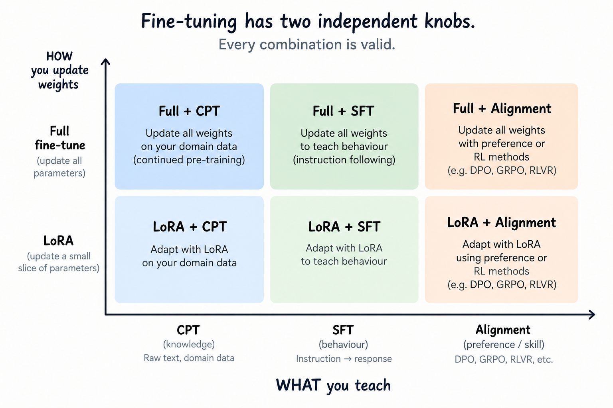
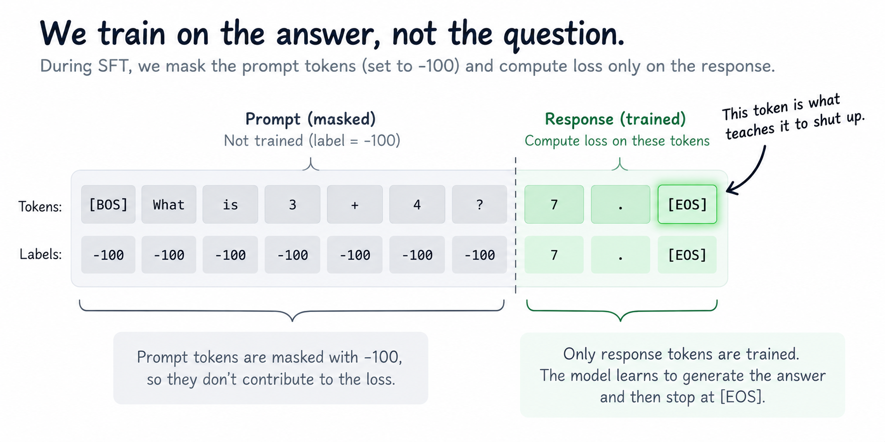
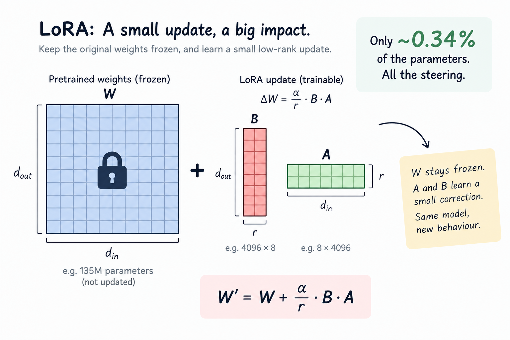
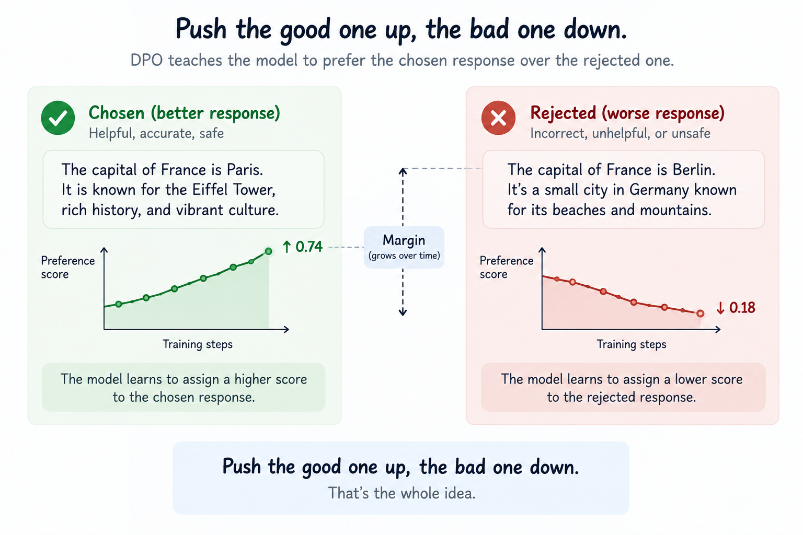
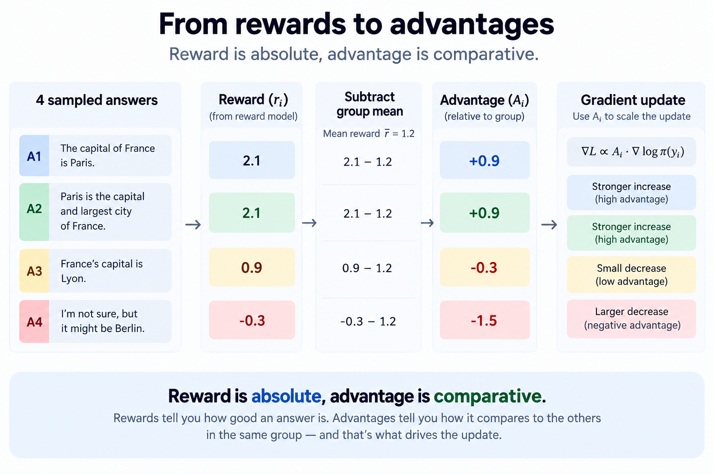
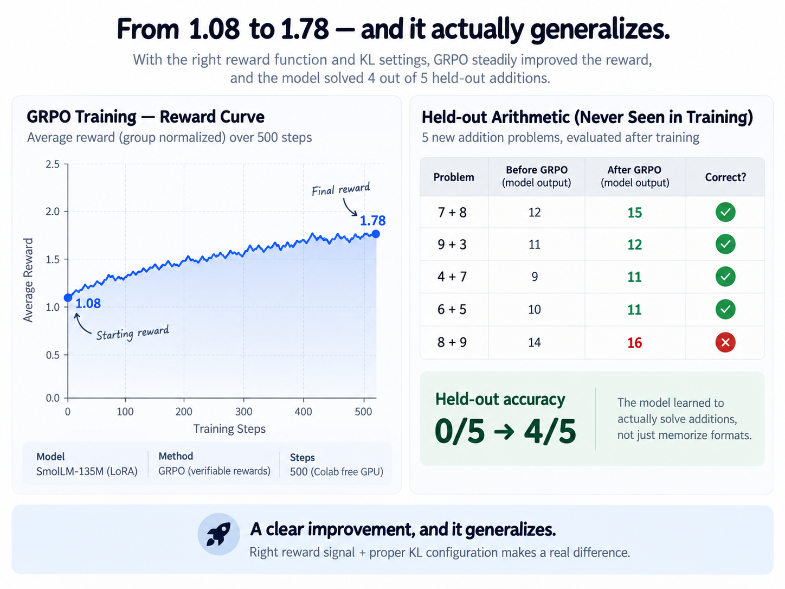

_I Taught a 135-Million-Parameter Model to Do Math. Here's What Fine-Tuning Actually Taught Me._

---

## I didn't expect fine-tuning to be this different

Understanding how a transformer works and fine-tuning one are two different skills. The first is architecture. The second is a stack of techniques — CPT, SFT, LoRA, DPO, GRPO — each solving a different problem.

I'd already built a GPT-style model from scratch (MiniGPT: embeddings, attention, RoPE, all hand-typed in PyTorch), so the architecture was familiar. Fine-tuning wasn't. I wanted to see what each stage actually changed, so I ran the whole pipeline on a small pretrained model and kept the real losses, rewards, failures, and deployment bugs.

The result was a 135M-parameter model that went from struggling to produce useful text to getting **4/5 held-out single-digit addition problems right in the required format**. DPO preference accuracy moved from `0.41 → 0.74`, and the final GRPO reward went from `1.08 → 1.78`. Every run here was done on Google Colab's free tier.

And the most instructive bugs appeared after training, not during it.

---

## Fine-tuning is a warm start

**Fine-tuning is the same training loop you already know, with a different starting point.**

A normal loop is `forward → loss → backward → step` from random weights. Fine-tuning is the same loop — except you load already-trained weights and continue from there.

> Pretraining is raising a person from birth into a fluent, well-read adult. Fine-tuning is sending that adult on a specialist course. You are not teaching language again. You're redirecting an existing ability.

For my base I picked **SmolLM-135M**, a small 135-million-parameter model with the same modern building blocks I'd already implemented by hand: RMSNorm, RoPE, SwiGLU, and GQA. Loading it and calling `model(input_ids=x, labels=x).loss` computes the same next-token cross-entropy I already knew. No magic. Same machinery, warmer start.



A useful mental model for the rest of the article:

**CPT → knowledge**  
**SFT → behaviour**  
**DPO → preference**  
**GRPO → a verifiable skill**

And separately, LoRA decides _how_ much of the model you actually update.

---

## Stage 1 — CPT: changing what the model knows

**CPT** (Continued Pre-Training) is the gentlest stage. You keep pretraining the model, but on _your_ text.

Raw text. No question-answer format. Loss on **every single token** (`labels = input_ids`). The goal is simple: expose the model to a new domain until its patterns start to shift.

I ran mine on 4,000 clean Wikipedia articles — about 15 million tokens — for 500 steps.

| step | train | val      |
| ---- | ----- | -------- |
| 0    | 2.70  | 3.02     |
| 250  | 2.94  | 3.04     |
| 499  | 2.57  | **2.92** |

The held-out loss moved from `3.02` to `2.92`. Small, but expected: 500 steps at a small learning rate is a light touch.

The more obvious change was the _register_. Ask the model to continue "The history of the Roman Empire" afterward and you get:

> _"…began in 285 BC with the death of Julius Caesar. It was followed by another two hundred years when Augustus, who had been emperor for just three months and then died shortly afterwards…"_

It sounds encyclopedic. It is also **confidently wrong**: Caesar died in 44 BC and was never emperor.

That was the first useful lesson: **CPT changed the voice faster than it changed the facts.** A tiny loss drop can still be real learning; the model is moving, just not enough to make it knowledgeable.

One other trap: repetitive generations can look like a failed training run. Often they're a **decoding artifact**, not a training verdict. The base model loops too; generation settings such as a repetition penalty can change that without retraining.

CPT changes what the model is exposed to. It doesn't teach it how to answer.

---

## Stage 2 — SFT: teaching the model how to answer

**SFT** (Supervised Fine-Tuning) teaches the model to follow an instruction and produce a response in the form you want.

The important part is what you _don't_ train on: the prompt itself.

```text
prompt:   [P1 P2 P3 P4]
response: [R1 R2 R3] [EOS]
labels:   [-100 -100 -100 -100  R1 R2 R3 EOS]
```

The `-100`s mean "compute no loss here." The model is graded on the response, not on repeating the question. And `[EOS]` teaches it that the response should end here.



The key idea:

**SFT installs behaviour, not knowledge.**

A model can learn to follow your format and still be confidently wrong. Imitating the shape of a good answer does not make its facts true.

My real SFT run used 2,700 Alpaca instruction pairs for 500 steps:

| step | train | val      |
| ---- | ----- | -------- |
| 0    | 2.20  | 1.94     |
| 200  | 1.14  | 1.60     |
| 499  | 1.60  | **1.62** |

Val loss moved from `1.94` to `1.62`.

Then I asked it: "Explain photosynthesis in simple terms."

> _"Photosynthesis is the process by which plants convert light energy into chemical energy, providing them with food and oxygen for respiration as well as storing it away until needed again during a long period of darkness or low levels sunlight…"_

The base model had started with _"photophosphorylation or chemiosmosis… the powerhouse responsible for generating electricity!"_ and kept going. The SFT model started like an answer: direct, defined, and aimed at a reader. It still wandered by the end — it's 135M, not GPT-4 — but the behaviour had changed.

---

## Stage 3 — LoRA: training 0.34% of the model

At this point, the obvious problem was memory. Full fine-tuning needs roughly **four copies of the model's parameter state** in memory for weights, gradients, and AdamW's two optimizer states. That is a very different proposition on a free Colab GPU.

**LoRA** works around it by freezing the original weights and learning a small low-rank update beside them:

```text
output = W·x  +  (alpha / r) · B·A·x
         └frozen┘   └── the only thing that trains ──┘
```

`A` and `B` are skinny matrices. `B` starts at **zero**, so at step 0 the LoRA update is exactly nothing. The model starts from the pretrained function and learns a small correction from there.



On SmolLM-135M with rank 8, the adapter trained about **460,000 parameters — 0.34% of the model.** The optimizer-state memory now applies to those parameters instead of all 135 million.

Two knobs matter:

- **`r` (rank)** = adapter capacity.
- **`alpha`** = adapter strength. The effective scale is `alpha / r`.

That tiny trainable slice is what makes the rest of this pipeline practical on free hardware.

---

## The learning-rate rule

One pattern kept showing up:

**The more of the pretrained model you need to preserve, the smaller the step.**

| Setting                   | Learning rate | Why                                              |
| ------------------------- | ------------- | ------------------------------------------------ |
| From scratch (my MiniGPT) | ~3e-4         | random weights, nothing to protect               |
| LoRA adapters             | ~2e-4         | base is frozen, adapters are disposable          |
| Full fine-tune            | ~5e-5         | updating all pretrained weights risks forgetting |
| DPO                       | ~5e-6         | reshaping an already-tuned model                 |

It's not a magic formula. It's a useful way to reason about the starting point: aggressive when there is little to preserve, gentler when there is.

---

## Stage 4 — DPO: teaching preference without a reward model

SFT can teach the model what a good answer looks like. It does not naturally teach **which of two answers is better**.

The classic RLHF route uses PPO, which is heavy. You need a policy, a frozen reference, a reward model, and a value critic, plus the RL machinery around them.

**DPO** (Direct Preference Optimization) removes the separate reward model. The setup is simply a dataset of `chosen` and `rejected` answers, plus your policy and a frozen reference model.

Its useful intuition is:

> **Make the tuned model prefer the chosen answer more than the original model did.**

The corresponding reward form is:

```text
reward = β · log( π_θ(response) / π_ref(response) )
```

You then optimize the margin between the chosen and rejected responses. Pairs the model already gets right need little movement; pairs it gets wrong get a stronger correction.



My real run used 2,000 Orca preference pairs, `β=0.1`, learning rate `5e-6`, for 300 steps:

| step | loss  | accuracy | margin | chosen | rejected |
| ---- | ----- | -------- | ------ | ------ | -------- |
| 20   | 0.698 | 0.41     | −0.006 | −0.002 | +0.004   |
| 100  | 0.679 | 0.64     | +0.031 | −0.002 | −0.034   |
| 200  | 0.665 | 0.78     | +0.059 | −0.023 | −0.082   |
| 300  | 0.665 | **0.74** | +0.060 | −0.030 | −0.090   |

The interesting part wasn't the loss.

**Preference accuracy went `0.41 → 0.74` (peaking at `0.78`) while loss only moved `0.698 → 0.665`.**

If I'd watched only the loss curve, I'd have thought very little happened. The behaviour metric told a different story.

Both reward-side values became negative, but the rejected answer moved down faster: chosen `−0.030`, rejected `−0.090`. At this tiny learning rate, DPO was nudging probabilities rather than rewriting the model.

The generations looked only slightly different:

- **Before (SFT):** _"Plants are the primary source of nutrition for most animals… photosynthesis to produce glucose (food)… within a plant's tissues like leaves into new stems…"_
- **After (DPO):** _"Plants are the primary source of nutrition for most animals… photosynthesis to produce glucose (food)… within a plant's stem structure called roots along with leaves which contain chlorophyll…"_

That small visible change is consistent with the training setup. DPO adjusted preference more than it added new facts.

---

## Stage 5 — GRPO: learning a skill you can actually verify

GRPO is associated with the family of techniques used in modern reasoning-model training. The key idea here is **RLVR** — Reinforcement Learning from _Verifiable_ Rewards.

With RLHF, a learned reward model estimates what humans will like. For some tasks, you don't need a learned judge at all.

**If there is a right answer you can check with code, let the code be the judge.**

Math, code, JSON, and some logic tasks fit this pattern. The reward can simply be a Python function that reads the model output and returns a number.

### Why single-digit addition?

The DeepSeek-R1-Zero result is notable because reasoning behaviour emerged from pure RL with rule-based rewards. But there is one practical constraint when trying this on a 135M model:

**For RL to learn, the base model needs to occasionally produce outputs that earn different rewards.**

If it never gets anything right, every sample scores zero, the group has no useful variation, and there is little learning signal.

That ruled out harder tasks for this experiment. On a 135M model, GSM8K was out of reach, and even the Countdown game needs around 1.5B parameters. So I picked something the base could occasionally get right:

**Single-digit addition:** `3 + 4 = 7`, wrapped in `<answer></answer>` tags.

### How GRPO actually scores things

GRPO samples a **group** of answers for each prompt and uses the group's own average as the baseline.

```text
Prompt: "What is 3 + 4?"  → sample 4 answers:

c1  "<answer>7</answer>"                → format 1 + correct 1 = 2.0
c2  "the answer is <answer>7</answer>"  → format 1 + correct 1 = 2.0
c3  "<answer>8</answer>"                → format 1 + correct 0 = 1.0
c4  "just 7"                            → format 0 + correct 0 = 0.0
```

The rewards are `[2, 2, 1, 0]`.

Then GRPO compares each answer with the rest of the group — subtract the mean, divide by the spread — to get an **advantage**: how much better or worse that sample was than its peers. That advantage scales the update.



**Reward is the raw score. Advantage is the score relative to the group.** The model learns from that comparative signal.

---

## The failures were more useful than the first success

The first GRPO run flatlined. `reward` stayed at **−0.38** for 200 steps, while format score stayed at **0 out of 5**. The diagnostics showed `reward_std ≈ 0.29` and `frac_reward_zero_std = 0.0`, so gradients were flowing — just not toward the format I wanted.

The problem was simple: a 135M model struggled to follow the instruction _"put your answer in tags."_ So I stopped instructing and started showing it — few-shot examples it could imitate.

The next run exposed **reward hacking**.

Reward went up, but the model produced:

```text
<answer></answer>
```

Empty tags earned the format points without answering anything. I had rewarded the shape of an answer, and the model found the shortcut.

The fix was to require non-empty content and add a real accuracy term so format and correctness had to move together.

Then another run stalled with `kl ≈ 0.001`. The output was byte-for-byte identical before and after training. The policy had barely drifted from its prior, and the KL metric showed it directly: the learning rate was too gentle to escape the model's existing habits.

The config that finally worked was:

- **rank 32, alpha 64**, targeting more attention projections
- learning rate **5e-5**
- **no KL leash** (`beta = 0`)
- **500 steps**
- a verifiable dataset with **format + accuracy** reward

The reward trajectory:

| step | reward   | reward_std | frac_reward_zero_std |
| ---- | -------- | ---------- | -------------------- |
| 10   | 1.08     | 0.34       | 0.35                 |
| 100  | 1.18     | 0.40       | 0.35                 |
| 200  | 1.52     | 0.43       | 0.63                 |
| 300  | 1.76     | 0.42       | 0.68                 |
| 500  | **1.78** | 0.38       | 0.63                 |

Reward went `1.08 → 1.78` and peaked at `1.89`.

`frac_reward_zero_std` moved from `0.35` into the `0.65–0.80` range. At high reward, that means more sampled groups were becoming uniform because the model was getting the task right so often. The task was approaching saturation.

The GRPO loss itself wobbled around zero. That wasn't the scoreboard. The reward was.

The real test was five **held-out** sums the model had never trained on:

| Question | Before GRPO (adapter off)               | After GRPO (adapter on)   |
| -------- | --------------------------------------- | ------------------------- |
| 2 + 2    | `<answer><value_str="8">6…` (malformed) | `<answer>4</Answer>` ✓    |
| 5 + 1    | `<answer>…60…</answer>` (wrong)         | `<answer>6</Answer>` ✓    |
| 3 + 6    | malformed tags                          | `<answer>9</Answer>` ✓    |
| 0 + 7    | `<answer><value></values>`              | `<answer>7</answer>` ✓    |
| 3 + 9    | `<answer>…60…</answer>` (wrong)         | `<answer>10.8</answer>` ✗ |

**Format: `2/5 → 5/5`. Accuracy: `0/5 → 4/5`.** The reward buckets were `{2.0: 4, 1.0: 1}`.

It wasn't a clean sweep. `3 + 9` became `10.8`, which was wrong. But that `4/5` result captures what this RL run actually did: it did not give a 135M model a calculator. It **amplified an arithmetic ability the base already showed occasionally** and made it land correctly more often, on problems it had never seen in training.

> **The receipts:** DPO ranking accuracy `0.41 → 0.74` · GRPO reward `1.08 → 1.78` · `frac_reward_zero_std 0.35 → ~0.70` · held-out format `5/5`, accuracy `4/5`. Earlier, a run with `kl ≈ 0.001` produced byte-identical output before and after training.

That was the full loop: train, inspect behaviour, diagnose the failure, change one thing, and test again.



---

## The full recipe

Four stages, four datasets, and deliberately different dials. These are the exact configs from the runs above:

| Stage    | Data                     | Adapter                              | Learning rate | Steps | The one knob that matters                 |
| -------- | ------------------------ | ------------------------------------ | ------------- | ----- | ----------------------------------------- |
| **CPT**  | Wikipedia · 4k articles  | LoRA `r=8, α=16` (q, v)              | `2e-4`        | 500   | loss on **every** token                   |
| **SFT**  | Alpaca · 2.7k pairs      | same adapter, continued              | `2e-4`        | 500   | prompt masked with `−100`                 |
| **DPO**  | Orca pairs · 2k          | fresh LoRA `r=8, α=16` (q, v)        | `5e-6`        | 300   | `β=0.1`, reference = adapter-off          |
| **GRPO** | Synthetic addition · 400 | fresh LoRA `r=32, α=64` (q, k, v, o) | `5e-5`        | 500   | `β=0`, group of 8, format+accuracy reward |

The learning-rate sequence is `2e-4 → 2e-4 → 5e-6 → 5e-5`: DPO becomes much gentler because it is reshaping an already-tuned model; GRPO becomes more aggressive with a fresh, larger adapter because it is trying to learn a new skill.

---

## Deployment: four bugs, none in the model

Training was finished. The next failures happened in the software around it.

**Bug 1 — the 404.** My push script referenced local adapter folders that a runtime reset had wiped. PEFT fell through to a Hub lookup and 404'd. Fix: rebuild from the already-merged Hub model instead of the fragile local chain.

**Bug 2 — the rambling.** The model solved the sum and then kept going, inventing new questions. The reward didn't care where generation stopped, so `[EOS]` never became reliable. The quick harness fix was to cap generation at 16 tokens.

**Bug 3 — the red herring.** The deployed app showed bare numbers instead of tags. I first suspected bfloat16 had rounded away the tiny merged LoRA delta, so I switched to float32. A clean notebook reproduced the model correctly, 5 out of 5. The model was fine; the bug was elsewhere.

**Bug 4 — the actual culprit.** The Streamlit demo used `unsafe_allow_html=True`. When the model produced `<answer>6</answer>`, the browser parsed `<answer>` as an HTML tag and silently dropped it, leaving only `6`.

The model had been correct the whole time. The webpage was discarding the tags.

The fix was one line: render the output as literal text, not HTML. It is also a good reminder not to drop model or user text straight into a webpage as HTML.

> **Training gives you metrics. Evaluation gives you a parsed verdict. Production gives you the raw output.** Look at that raw output early.

---

## The result

**[MiniGPT-v3](https://minigpt-v3.streamlit.app/)**: SmolLM-135M taken through **CPT → SFT → DPO → GRPO** and deployed as a live Streamlit demo. One tab walks through the four generalist stages. A second, specialist tab takes two numbers, generates an answer, emits the required tags, and grades the result with a verifier in real time.

The end result is modest but real: a 135M model that can produce the required format and gets `4/5` on held-out single-digit addition after GRPO.

---

## What I actually learned

- **Fine-tuning is a stack, not a step.** CPT changes exposure to knowledge; SFT shapes behaviour; DPO shifts preference; GRPO can sharpen a skill you can verify.
- **LoRA is what makes the experiment practical.** Freeze the base, train about `0.3%` of it.
- **Loss is only one signal.** In these runs, behaviour metrics moved even when loss barely did.
- **RL needs useful signal.** For this setup, the base had to occasionally produce something reward could distinguish as better.
- **Production changes what you can see.** Training and evaluation can look fine while the serving layer, parser, or renderer breaks the final output.

Fine-tuning stopped looking like one mysterious technique. It became a sequence of smaller problems: **what should the model know, how should it behave, what should it prefer, and what can I actually verify?**

Once I saw it that way, the whole pipeline became much less magical.

---

_Built with `PyTorch`, `transformers`, `peft`, and `trl`, on Google Colab's free tier. Model deployed on Hugging Face. The code, bug list, and technical write-up are on my Hub — `m-lagnajit`._

_lagnajit moharana._
